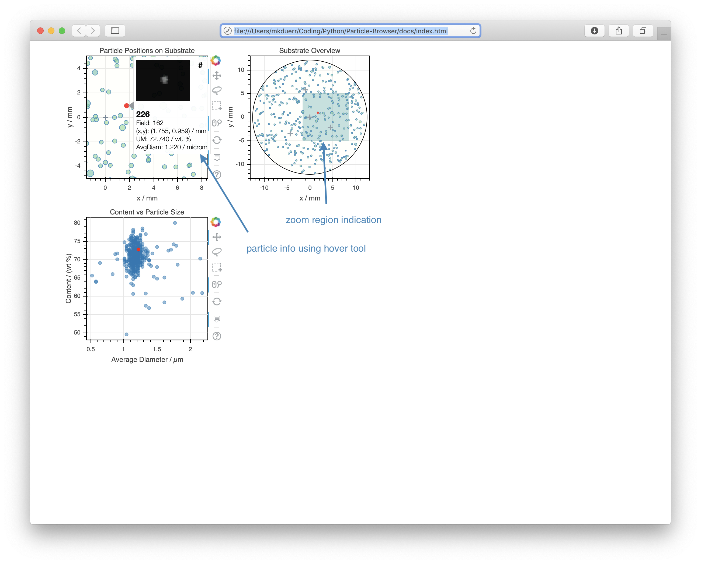

# Particle Browser
Interactive visualization of particles collected on substrate using processed scanning electron microscopy images.

Prototype developed for product control in a project to provide synthetic particles on substrates.

## Background

Substrate samples were to be produced within a quality controlled process.
The samples ready to be shipped had been characterized by scanning the
substrate surface with an electron microscope. The obtained imaging data is
processed and an interactive visualization is generated which allows easy
inspection by the customer. The interactivity empowers the customer to verify
the quality with his own means without the need to undertake extensive
efforts.
## Data Processing & Generating the Visualization

* The python script [process_PAsearch.py](Python/process_PAsearch.py) processes the raw data of a given substrate.

* The raw data is in a directory, like the directory [DemoData](Python/DemoData).

* The python script [create_bokehplot.py](Python/create_bokehplot.py) to render the bokeh interactive plots.

* The python script [PB_GeneratePage.py](Python/PB_GeneratePage.py) generates a html.

## Interactive Visualization

The interactive visualization allows the user to explore the particle
properties on the substrate:

Each particle is visualized by a dot. The dot-size is proportional to the
diameter of the particle. The color indicates with the weight content of the
element of interest.

A box or lasso selection tool allows to select a group of particles by their
properties *location on substrate* or *particle diameter* and *circularity*.

Check out for yourself [here](docs/index.md).

## Authors

* **Ronal Middendorp**
* **Martin Dürr**

## License

This project is licensed under the MIT License - see the [LICENSE.md](LICENSE.md) file for details

The raw data (including SEM images) is public domain.

  

